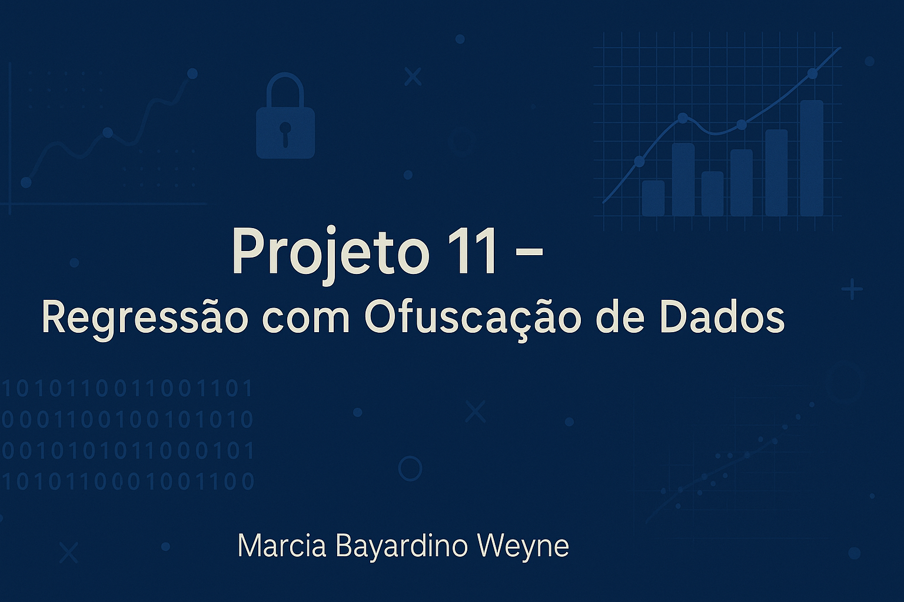

📊 Projeto 11 – Aprendizado de Máquina Seguro
Autora: Marcia Bayardino Weyne
Data: 2025

📝 Descrição do Projeto
Este projeto, desenvolvido para a companhia fictícia Proteja Seu Amanhã, visa aplicar aprendizado de máquina para resolver tarefas como:

Encontrar clientes semelhantes com KNN

Prever se um cliente receberá pagamento de seguro (classificação)

Estimar o número de pagamentos com regressão

Aplicar ofuscação de dados sem comprometer a performance do modelo

📑 Tabela de Conteúdo
Objetivo

Resultados

Ferramentas Utilizadas

Metodologia

Como Executar o Projeto

Aprendizados

Contato

Objetivo 🏔
Avaliar a viabilidade de modelos de Machine Learning em um cenário de seguros, incluindo técnicas de anonimização para proteção de dados pessoais.

Resultados 🏁
🎯 Regressão linear obteve bom desempenho com e sem ofuscação

🔒 Ofuscação embaralhou os dados sem deteriorar drasticamente o desempenho

📉 RMSE e R² comparados entre modelos originais e mascarados

Ferramentas Utilizadas 🧰
Caderno de desenvolvimento: Jupyter Notebook

Linguagem: Python

Bibliotecas: pandas • numpy • scikit-learn • matplotlib • seaborn

Ambiente: VS Code

Metodologia 🔍
1. Pré-processamento
Leitura do CSV

Tratamento de valores ausentes

Separação treino/teste

2. Modelagem
Regressão Linear

Avaliação: RMSE e R²

3. Ofuscação
Embaralhamento de colunas (mascaramento)

Re-treinamento e comparação de desempenho

4. Visualização
Gráfico de comparação

Análise de resíduos e correlação

Como Executar o Projeto 💽
Pré-requisitos:

Python 3.10+

Jupyter Notebook

Instalar bibliotecas com:

bash
Copiar
Editar
pip install -r requirements.txt
Execute:

bash
Copiar
Editar
jupyter notebook
Abra Projeto11_Ofuscacao_Regressao.ipynb e siga a ordem das células.

Aprendizados 📝
Técnicos:
Aplicação de regressão linear

Criação de função de ofuscação (mascaramento)

Comparação de métricas com dados sensíveis protegidos

Profissionais:
Estruturação de projeto para GitHub

Escrita de documentação técnica

Uso do VS Code + Git + GitHub

Contato 😄
Marcia Bayardino Weyne
📫 mbweyne@gmail.com

